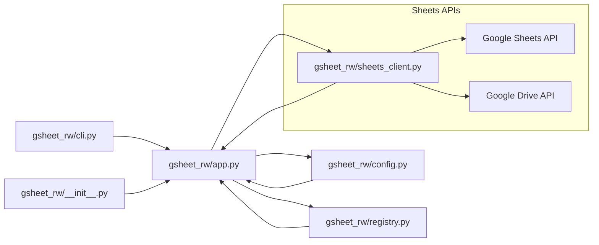

# Google Sheet Reader Writer

Sample CLI app (Python + Fire) that:
1. Loads a CSV into a Pandas DataFrame and create a Google Sheet populated with that data, **protecting all columns except the last two**
   (`Judge Assigned`, `Comments`), then share it with a list of users.
2. Reads a Google Sheet into a DataFrame and export it to CSV.

## CSV schema

Expected columns (in this order):

- Division
- Rank
- Age
- Last Name
- Ring #
- Competitor Count
- Judge Assigned
- Comments

## Google Cloud setup

### Enable APIs

Google Cloud Console → APIs & Services → Library → enable:

- Google Sheets API
- Google Drive API

## Auth options

This project supports three auth modes via `config/config.yaml`:

- `auth_mode: "adc"` (recommended for personal `@gmail.com`)
- `auth_mode: "oauth"` (desktop OAuth client)
- `auth_mode: "service_account"` (recommended for Google Workspace + Shared Drive)

### ADC setup (personal Gmail)

Run once (and again if scopes change):

```bash
gcloud auth application-default login --scopes="https://www.googleapis.com/auth/spreadsheets,https://www.googleapis.com/auth/drive"
```

### OAuth setup (personal Gmail)

1. Google Cloud Console → APIs & Services → OAuth consent screen
   - User type: **External**
   - Add yourself as a test user (or publish, if needed)
2. APIs & Services → Credentials → Create Credentials → **OAuth client ID**
   - Application type: **Desktop app**
3. Download the OAuth client JSON as `credentials.json` next to `config/config.yaml`
   (or set `oauth_client_secret_json` in `config/config.yaml`).
4. Optional: set `oauth_token_path` in `config/config.yaml` (where the tool can write `token.json`).
   If omitted, the default is:
   - macOS: `~/Library/Application Support/gsheet-rw/token.json`
   - Windows: `%APPDATA%\gsheet-rw\token.json`
   - Linux: `~/.config/gsheet-rw/token.json`
5. First run will open a browser for consent; it will write/refresh `token.json` automatically.

### Service account setup (Workspace / automation)

1. IAM & Admin → Service Accounts → Create (e.g., `karate-tournament-sheets-bot`)
2. Create a JSON key (Keys → Add Key → JSON) and set `service_account_json` in `config/config.yaml`.
3. (Recommended) Create a Drive folder and share it with the service account email as **Editor**; set `drive_folder_id`.

> Note: Service accounts often cannot create files in personal Gmail Drive, and may have zero Drive quota. Use OAuth for personal Gmail.

## Local setup

```bash
python -m venv .venv
source .venv/bin/activate
pip install -r requirements.txt
pip install -e .
```

## Testing

### Integration test (optional)

An integration test is available and runs only when environment variables are set:

```bash
RUN_INTEGRATION_TESTS=1 \
SANDBOX_SPREADSHEET_ID="..." \
SANDBOX_WORKSHEET_TITLE="..." \
pytest -k integration
```

Optional env override:
- `GSHEET_RW_CONFIG_PATH` (defaults to `config/config.yaml`)

## Usage

## Interaction diagram



### Create a sheet from CSV

You can either pass `--sheet_title` on the CLI or set `spreadsheet_title` in `config/config.yaml`.
If both are provided, the CLI argument wins.

```bash
gsheet-rw create_from_csv \
  --csv_path "./data/test_data.csv" \
  --sheet_title "Karate Tournament - Ring Assignments" \
  --drive_folder_name "root" \
  --config_path "./config/config.yaml"
```

You can also call the library directly with an in-memory config:

```python
from pathlib import Path

from gsheet_rw import create_from_csv
from gsheet_rw.config import AppConfig

cfg = AppConfig(
    auth_mode="oauth",
    oauth_client_secret_json=Path("./secrets/credentials.json"),
    oauth_token_path=Path("./secrets/token.json"),
    owner_email="you@example.com",
    share_emails=["judge1@example.com", "judge2@example.com"],
    drive_folder_name="root",
    spreadsheet_title="Tournament Judges Sheet",
    worksheet_title="Initial",
)

create_from_csv(
    csv_path="./data/test_data.csv",
    config=cfg,
)
```

Notes:
- `drive_folder_name` is required for create. Use `"root"` for My Drive root.
- Each update writes data into a **new tab** named with a timestamp (`YYYY-MM-DD HH:MM:SS`).
- The tool tracks `(folder_name, sheet_title) -> spreadsheet_id` in `data/sheet_registry.yaml`
  to avoid creating duplicates.

### Export a sheet to CSV

Spreadsheet ID is the part after `/d/` in the URL:
`https://docs.google.com/spreadsheets/d/<SPREADSHEET_ID>/edit`

```bash
gsheet-rw export_to_csv \
  --spreadsheet_id "<SPREADSHEET_ID>" \
  --csv_path "./out/export.csv" \
  --config_path "./config/config.yaml"
```

If `worksheet_title` is omitted, the export uses the most recent timestamp-named tab.

## Column protection behavior

- The tool protects columns **A..(N-2)** (all except the last 2 columns).
- Only `owner_email` (from config) is allowed to edit protected columns.
- Shared users can still edit the last 2 columns.
