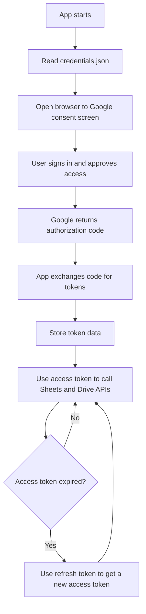
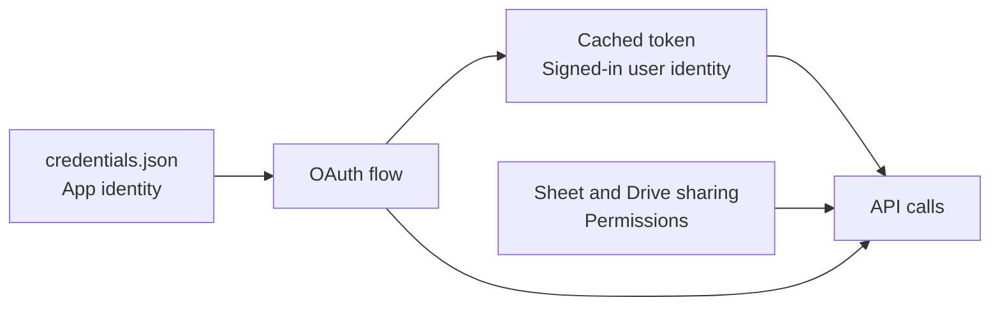
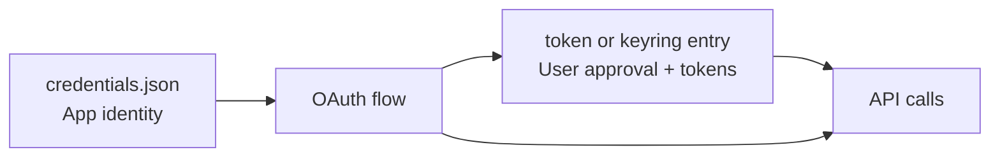
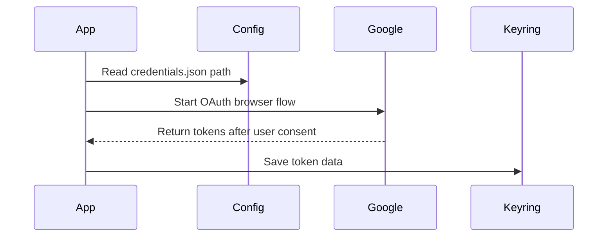
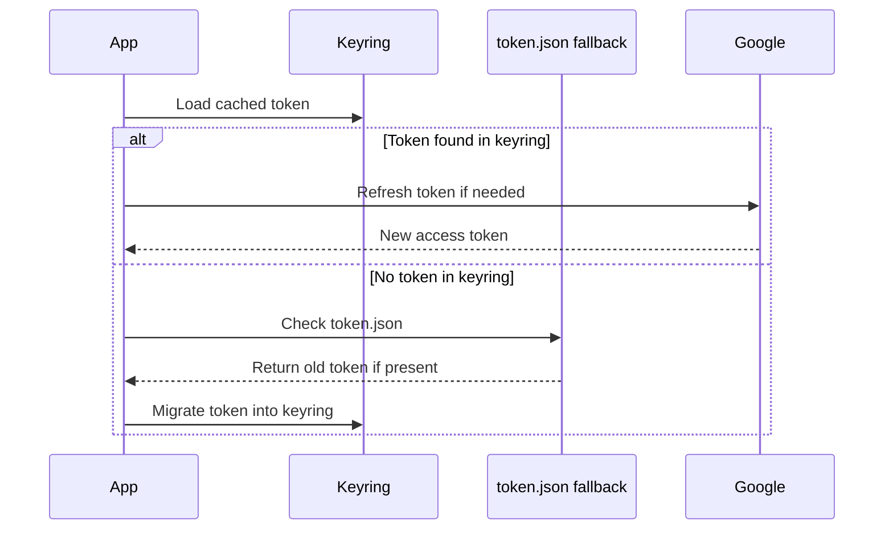
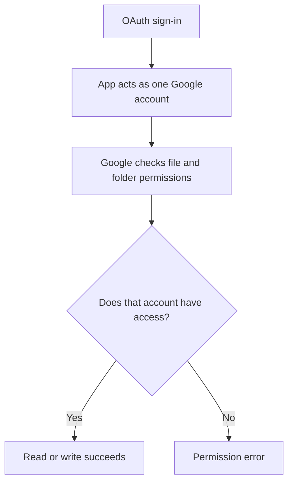
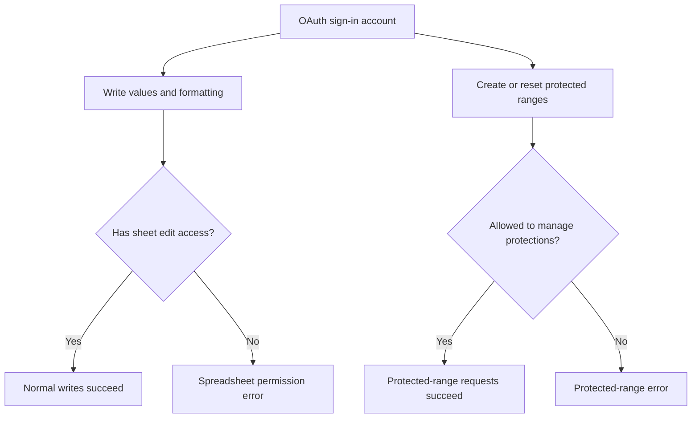
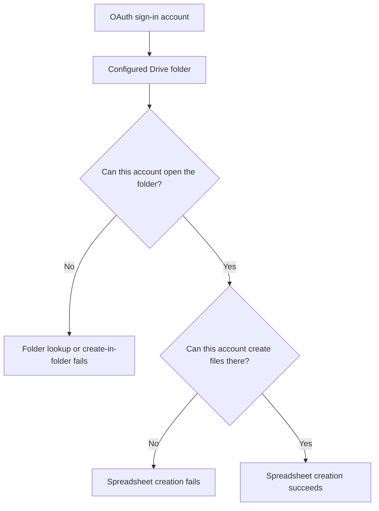
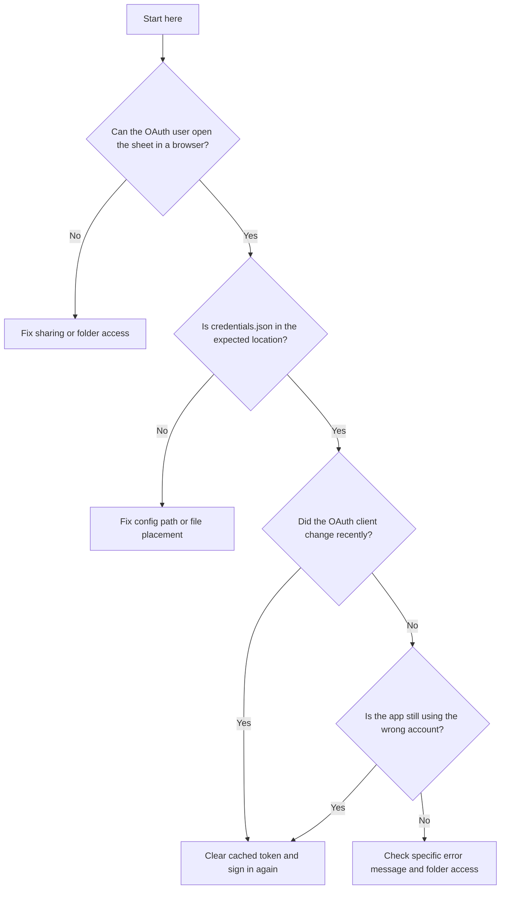

# Guide To Authentication Setup

This document explains how authentication is set up for this project and how to troubleshoot it.

The goal is practical setup, not OAuth theory.

If you are trying to get the project working, focus on these questions:

- which Google account is the app using?
- where does the app read `credentials.json` from?
- where is the cached token stored?
- does that Google account have access to the target spreadsheet or Drive folder?
- does that Google account have enough access to create and manage protected ranges?

## Short version

- `credentials.json` tells Google what app this is.
- the cached token tells Google which user already signed in.
- spreadsheet and Drive sharing determine whether that user can actually access the files.

Or even shorter:

- `credentials.json` = app identity
- token = user session data
- sharing = file access rules

## Minimum working setup

If you just want the shortest path to a working setup, do these steps in order:

1. In Google Cloud Console, enable the Google Sheets API and Google Drive API.
2. Create an OAuth client of type `Desktop app`.
3. Download that OAuth client JSON file.
4. Put it at `secrets/credentials.json` in this project.
5. Make sure `config/config.yaml` points to `../secrets/credentials.json`.
6. Decide which Google account you will use for OAuth sign-in.
7. Make sure that same Google account has access to the target spreadsheet or Drive folder.
8. Run the app once and complete the browser sign-in flow.
9. Confirm the app works.

If something still fails after that, the most likely causes are:

- the wrong Google account signed in through OAuth
- the spreadsheet is not shared with that account
- the Drive folder is not shared with that account
- the signed-in account is not included in the protected-range editor allowlist
- the cached token is stale and needs to be cleared

## Authentication pieces you need to set up

For this project, authentication depends on four things:

1. `credentials.json`
2. the cached OAuth token
3. the Google account used during OAuth sign-in
4. Google Drive and Google Sheets sharing permissions

If any one of those is wrong, setup can fail.

## What each file does

### `credentials.json`

This file comes from Google Cloud Console when you create an OAuth client.

It contains information such as:

- `client_id`
- `client_secret`
- Google's auth URLs
- redirect URIs

Think of it as the app's ID card.

The app uses it to say to Google:

`I am this registered application, and I want to ask the user for permission.`

### Cached token

This is created only after a user completes the browser sign-in and consent flow.

It typically contains things such as:

- `access_token`
- `refresh_token`
- token expiry time
- scopes
- the `client_id`
- the `client_secret`

Think of it as the remembered result of a successful sign-in.

The app uses it to say to Google:

`This user already approved access before. Please let me continue without asking again.`

## The flow in one picture



## App identity vs user identity vs file permissions



## The two auth files side by side



## How this project uses them

In this project:

- `credentials.json` is still read from the path in `config/config.yaml`
- the OAuth token is stored in the system keyring first
- if keyring does not have the token, the app still checks `oauth_token_path` on disk
- if the disk token is found, the app migrates it into keyring

So today, the fallback `token.json` path is mainly:

- a backward-compatibility fallback
- a debugging/reset convenience

## Why both are needed

Because they solve different problems:

- `credentials.json` identifies the app to Google
- token or keyring identifies the user's approved session

You cannot replace one with the other.

## Why `credentials.json` is not stored in keyring here

For this project, that usually would not help much.

Reasons:

- `credentials.json` is mostly app configuration
- the token is the more important per-user secret
- the app needs the OAuth client JSON as a startup input anyway
- replacing or rotating the OAuth client is simpler as a normal file

Also, for a desktop OAuth client, the `client_secret` is not treated like a strong server-side secret.

So the practical design is:

- keep `credentials.json` as a configured file
- keep the user token in keyring

## Why a stale token can fail

A cached token can stop working if:

- the user revoked access
- the token expired and cannot be refreshed
- the OAuth client changed
- the stored token was created with a different client secret

That is why this project now falls back to browser re-auth if token refresh fails.

## What happens on first run vs later runs

### First run

Plain-English version:

1. The app reads `credentials.json`.
2. The app opens a browser window.
3. You choose a Google account.
4. Google asks whether you want to allow this app to access Sheets and Drive.
5. If you approve, Google returns tokens to the app.
6. The app stores the token for later runs.
7. The app proceeds to call the Sheets and Drive APIs as that signed-in Google account.



### Later run

Plain-English version:

1. The app looks for a cached token.
2. It checks keyring first.
3. If keyring does not have one, it checks the fallback token file on disk.
4. If it finds a usable token, it reuses it.
5. If the access token is expired, it tries to refresh it.
6. If refresh fails, it falls back to browser sign-in again.



## Where the token lives in this project

The effective token storage rule for this project is:

1. keyring first
2. `oauth_token_path` second

That means:

- normal runs should use the token from keyring
- `oauth_token_path` exists mainly as a fallback and migration path
- if a token is found on disk but not in keyring, the app loads it and writes it into keyring
- if a new token is created, the app tries to store it in keyring first

So when you are thinking about the current implementation, the best mental model is:

- `credentials.json` lives on disk
- the active user token usually lives in keyring
- `token.json` is mostly compatibility and debugging support

## Practical rule of thumb

If you are debugging:

- do not edit `credentials.json` unless you intentionally changed the OAuth client in Google Cloud
- run `auth_status` to see what auth paths and token stores the app is actually using
- clear the cached token if sign-in behavior seems wrong

Command:

```bash
python -m gsheet_rw.cli auth_status --config_path ./config/config.yaml
```

Clear cached token:

```bash
python -m gsheet_rw.cli clear_oauth_token --config_path ./config/config.yaml
```

Full reset, including the filesystem fallback token:

```bash
python -m gsheet_rw.cli clear_oauth_token --config_path ./config/config.yaml --clear_filesystem_fallback true
```

## When should you clear the cached token?

Clear the cached token when:

- you changed `credentials.json`
- you created a new OAuth client in Google Cloud
- you want to sign in as a different Google account
- Google access was revoked and the app keeps failing
- the app keeps reusing the wrong account
- token refresh fails with errors such as `invalid_client`

Usually start with:

```bash
python -m gsheet_rw.cli clear_oauth_token --config_path ./config/config.yaml
```

Use the full reset only if you want to remove both:

- the keyring token
- the fallback `token.json` file

That command is:

```bash
python -m gsheet_rw.cli clear_oauth_token --config_path ./config/config.yaml --clear_filesystem_fallback true
```

## OAuth vs service account

This project supports both, but they are different models.

| Mode | Identity used by the app | What you share the sheet with | Best fit |
| --- | --- | --- | --- |
| OAuth | A human Google account chosen in the browser | That human Google account | Personal Gmail or interactive use |
| Service account | A service account email created in Google Cloud | The service account email | Automation or managed Workspace setups |

Simple rule:

- if you use `auth_mode: "oauth"`, share with the human Google account that signs in
- if you use `auth_mode: "service_account"`, share with the service account email

## How OAuth and Google Sheet sharing fit together

These are related, but they are not the same thing.

- OAuth answers: `Which Google account is this app acting as?`
- Google Sheet sharing answers: `What is that Google account allowed to do?`

Both must be correct.

## The most important setup rule

The Google account that signs in through the OAuth browser flow must also have access to the spreadsheet and any Drive folder the app needs to use.

If those do not match, the app will authenticate successfully but still fail when trying to read or write the sheet.

## Simple example

If you sign in through OAuth as:

`funkjohn@gmail.com`

then the app makes Google Sheets and Drive API calls as:

`funkjohn@gmail.com`

So:

- if `funkjohn@gmail.com` has access to the file, the app can work
- if `funkjohn@gmail.com` does not have access to the file, the app cannot work

Sharing the sheet with some other email does not help unless that other email is the one used in OAuth.

## One-picture explanation



## What permission level is needed for this project

This app does more than just read data.

It may:

- create spreadsheets
- create new tabs
- write cell values
- format cells
- protect ranges
- share the spreadsheet with other users

So the OAuth user generally needs edit-level access.

In practice:

- for an existing spreadsheet, share it with the OAuth user as `Editor`
- for a Drive folder used by this app, make sure the OAuth user can access that folder and create files in it
- if the sheet uses protected ranges, make sure the OAuth user is allowed to manage those protections

## If the app creates the spreadsheet

If the OAuth user creates the spreadsheet through the app, that user will normally already have the needed access.

That is the simplest case.

## If the spreadsheet already exists

You must share the spreadsheet with the exact Google account used during OAuth sign-in.

Usually that means:

- open the spreadsheet in Google Sheets
- click `Share`
- add the OAuth user's Google account
- give it `Editor` access

## If you use a Drive folder

This project can also look up and use a Drive folder.

In that case, the OAuth user needs access to the folder too.

Otherwise, folder lookup or file creation inside that folder can fail even if the user has access to some individual sheet.

That means the signed-in account must be able to do both:

- open the Drive folder
- create spreadsheets inside that Drive folder

If the app can read a spreadsheet but cannot create a replacement spreadsheet in the configured folder, authentication may appear to work while the overall workflow still fails.

## Protected ranges and the authenticated user

This project does not just write plain cell values.

It also creates and resets protected ranges on some sheets.

That means the signed-in OAuth account needs to be compatible with the protected-range rules too.

There are two separate questions:

- can this account edit the spreadsheet as a normal editor?
- can this account create, update, or delete the protected ranges used by this app?

For this project, both need to be true.

### Why this matters

The app now performs actions such as:

- deleting existing protected ranges during sheet reset
- creating new protected ranges during sheet formatting
- setting explicit allowed editors for those protected ranges

If the authenticated user is not allowed to participate in those protections, Google can reject the request even though ordinary sheet edits would succeed.

### Practical rule

The signed-in OAuth account should be included in the configured protected-range editor list.

In this project, that list is configured through:

- `protected_range_editor_accounts`

The app also tries to merge the currently authenticated account into the final editor list automatically.

That reduces configuration mistakes, but it does not remove the need for the authenticated account to already have enough spreadsheet access to manage the protections.

### One-picture explanation



### What can go wrong

Typical failure cases include:

- the OAuth user is a sheet editor, but is not included in the protected-range editor accounts
- the protected ranges were created by another account and the current user cannot delete or recreate them
- the app tries to create a protection that would remove the acting user from the editor list

These failures usually show up as Google Sheets `400` or `403` errors rather than an OAuth sign-in failure.

## Drive folder access and replacement spreadsheets

One subtle point is that folder access matters not just during the initial spreadsheet creation.

This project may also create a replacement spreadsheet when an existing spreadsheet contains orphaned named ranges that cannot be cleaned up through the API.

So the authenticated user must have enough Drive access for recovery workflows too.

In practical terms, the signed-in account needs to be able to:

- see the configured Drive folder
- create new spreadsheets in that folder
- share those spreadsheets if the workflow does that later

If the account cannot access the folder, the app may be forced to create a replacement spreadsheet somewhere else, such as the account's Drive root.

### Folder access in one picture



## How to verify your setup

Use this checklist:

1. Identify the Google account you use in the OAuth browser sign-in.
2. Open the target spreadsheet in a normal browser using that same Google account.
3. Confirm that you can edit the sheet manually.
4. If you are using a Drive folder, confirm that the same account can open that folder.
5. If the app is supposed to create new spreadsheets, confirm that the account can create files in that Drive location.
6. If the app uses protected ranges, confirm that the account is allowed to manage them.

If all six are true, your sharing setup is probably correct.

## Common confusion

People often think:

`I shared the sheet with the judge emails, so the app should work.`

But that is not enough.

The app works as the OAuth account, not as every person listed in `share_emails`.

So the required access must be granted to the OAuth account itself.

## `share_emails` in this project

The `share_emails` setting is for who the app will share the sheet with after it creates or updates it.

That setting does not define the identity the app uses.

The identity the app uses comes from the Google account that completed the OAuth sign-in flow.

## OAuth vs sharing in one sentence

OAuth decides `who the app is`.

Sharing decides `what that account can do`.

## Which email matters?

This is one of the most common sources of confusion.

There are several different email-related settings in this project, and they do different jobs.

### 1. The OAuth signed-in account

This is the most important one for authentication.

It is the Google account you choose in the browser during the OAuth sign-in flow.

This is the identity the app uses when calling Google Sheets and Drive.

If this account cannot access the spreadsheet or Drive folder, the app cannot either.

### 2. `protected_range_editor_accounts`

This is the configured list of accounts that should remain allowed to edit protected ranges.

It affects who the app places into the editor allowlist when protections are created.

It does not control which Google account the app authenticates as.

For the least confusing setup, this list should include the OAuth signed-in account.

### 3. `owner_email`

This is still project metadata, but it is no longer the main protected-range allowlist.

It does not control which Google account the app authenticates as.

### 4. `share_emails`

This is the list of people the app will share the spreadsheet with.

It is about who gets access after the spreadsheet is created or updated.

It does not decide which account the app uses.

### 5. Spreadsheet owner

This is the Google account that owns the file in Drive.

Sometimes this is the same as the OAuth user, but not always.

The OAuth user does not have to be the owner, but it usually does need enough access to do the work, which for this app normally means `Editor`.

## Email roles in one table

| Item | What it controls | Should it match the OAuth user? |
| --- | --- | --- |
| OAuth signed-in account | Who the app acts as | Yes, this is the app identity |
| `protected_range_editor_accounts` | Who can stay in protected-range editor lists | Yes, include the OAuth user |
| `owner_email` | Project owner metadata | Usually yes |
| `share_emails` | Who the app shares the sheet with | Not necessarily |
| Spreadsheet owner | Who owns the file in Drive | Not necessarily |

## Common error messages

These are the setup problems people are most likely to hit.

### `OAuth client secret JSON not found`

Meaning:

- the path to `credentials.json` is wrong

What to check:

- does the file actually exist?
- does `config/config.yaml` point to the right path?
- if you used a relative path, is it relative to `config/config.yaml`?

### `invalid_client`

Meaning:

- the cached token was tied to an old or different OAuth client
- or the current OAuth client configuration is wrong

What to do:

- verify `credentials.json` is the correct current OAuth client file
- clear the cached OAuth token
- run again and complete browser sign-in

### Permission denied / `403`

Meaning:

- the OAuth account authenticated successfully, but Google says it does not have permission to the file or folder

What to check:

- which Google account signed in through OAuth?
- can that exact account open the spreadsheet in the browser?
- can that exact account access the Drive folder?
- can that exact account create files in the Drive folder?
- can that exact account manage the protected ranges used by this app?

### Spreadsheet or folder not found

Meaning:

- the ID or folder lookup did not resolve
- or the OAuth account cannot see the resource

What to check:

- verify the spreadsheet ID or folder name
- verify the OAuth account can see it in Google Drive

### Browser sign-in keeps reappearing

Meaning:

- the token may not be getting refreshed
- the cached token may have been cleared
- or the OAuth client changed

What to do:

- check that keyring is available
- check whether `oauth_token_path` fallback is being used
- if you recently changed `credentials.json`, clear the cached token and sign in again

## Troubleshooting decision tree

If setup is still not working, follow this order:



Use this as a practical checklist:

1. Confirm which Google account the app is using in OAuth.
2. Confirm that exact account can open and edit the sheet in the browser.
3. Run `auth_status` and confirm the resolved paths and token store state look correct.
4. Confirm that exact account can access the Drive folder, if a folder is involved.
5. Confirm `credentials.json` exists where `config/config.yaml` says it does.
6. Confirm that exact account is included in `protected_range_editor_accounts` if the workflow uses protected ranges.
7. If the OAuth client changed or the wrong account was cached, clear the token and sign in again.

## What the log messages mean

These are some of the most useful auth-related log messages in this project.

### `oauth_token_source=keyring`

Meaning:

- the app found the cached OAuth token in keyring

What it usually means for you:

- token loading is working as intended

### `oauth_token_source=filesystem`

Meaning:

- keyring did not have the token
- the app found a fallback token at `oauth_token_path`

What it usually means for you:

- the app is still working
- the token will normally be migrated back into keyring

### `oauth_token_client_mismatch=true`

Meaning:

- the cached token was created for a different OAuth client than the current `credentials.json`

What it usually means for you:

- `credentials.json` was changed
- or an older token is still cached

What happens next:

- the app skips token refresh and goes straight to browser re-auth

### `oauth_token_refresh_failed=true`

Meaning:

- the cached token could not be refreshed

Common causes:

- `invalid_client`
- revoked access
- stale token
- mismatched OAuth client

What happens next:

- the app falls back to browser sign-in

### `oauth_signin_required=true`

Meaning:

- no usable cached token was found

What happens next:

- the browser should open for first-time or replacement sign-in

### `oauth_reauth_required=true`

Meaning:

- the app had credentials before, but they were no longer usable

What happens next:

- the browser should open again so you can re-authorize

### `oauth_token_keyring_read_failed=true` or `oauth_token_keyring_write_failed=true`

Meaning:

- the operating system keyring was unavailable or returned an error

What it usually means for you:

- the app may still continue by using the filesystem fallback token path
- but keyring storage is not working normally

### `OAuth client secret JSON not found at ...`

Meaning:

- the configured `credentials.json` path is wrong

What to do:

- check the path in `config/config.yaml`
- remember that relative paths are resolved from the config file directory

## Using `auth_status`

This command shows the authentication inputs the app is actually using:

```bash
python -m gsheet_rw.cli auth_status --config_path ./config/config.yaml
```

For OAuth mode, it reports:

- resolved `oauth_client_secret_json` path
- whether that file exists
- resolved `oauth_token_path`
- whether the fallback token file exists
- whether keyring currently has a cached token

This is often the fastest way to debug path mistakes and token confusion.

## External references

These are the most useful official references for a non-expert:

- Google OAuth overview: https://developers.google.com/identity/protocols/oauth2
- Google OAuth for desktop apps: https://developers.google.com/identity/protocols/oauth2/native-app
- Google explanation of refresh tokens for installed apps: https://developers.google.com/youtube/reporting/guides/authorization/installed-apps
- Python `google-auth` docs for stored authorized-user credentials: https://google-auth.readthedocs.io/en/latest/_modules/google/oauth2/credentials.html

## One last mental model

If this were a hotel:

- `credentials.json` is the hotel's business license
- `token.json` or keyring token is your room key

The hotel needs its license to operate.
You need your room key to get back into your room.
